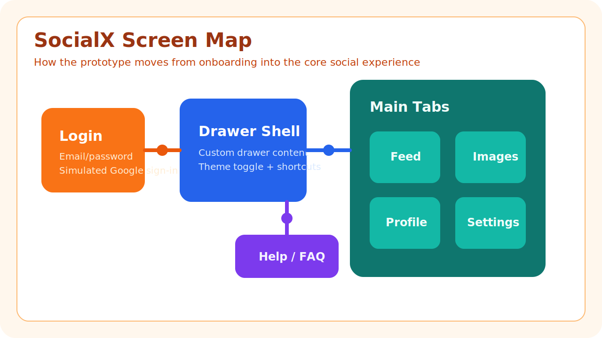
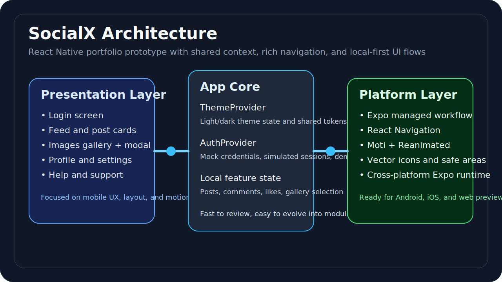

# SocialX

SocialX is a React Native and Expo social media prototype focused on mobile interaction design, state management, and navigation patterns. The project combines a mock authentication flow, an interactive feed, image discovery, profile views, settings, and motion-rich transitions in a single portable demo app.



## What this project demonstrates

- Building a multi-screen mobile experience with Expo and React Native.
- Combining drawer and bottom-tab navigation without losing UX clarity.
- Managing shared app state with lightweight React Context providers.
- Designing animated, theme-aware interfaces for a portfolio-ready frontend.
- Shipping a realistic prototype quickly with clear room for production hardening.

## Feature highlights

- Mock email/password authentication with a simulated Google sign-in path.
- Feed interactions for likes, comments, and share actions.
- Image discovery gallery with modal previews.
- Profile and settings screens with theme switching.
- Help and support content embedded directly into the app.
- Motion-driven interface touches using Moti and React Native Reanimated.

## Architecture overview



SocialX currently keeps most UI logic inside [App.js](App.js) so the entire prototype is easy to review in one place. For an interview, that is a good talking point: the next production step would be extracting screens, components, hooks, and service layers into dedicated modules.

## Demo credentials

Use either of the following accounts in the demo build:

- `user@example.com` / `123456`
- `alice@example.com` / `123456`

## Local development

```bash
git clone https://github.com/Neth766/socialx-app.git
cd socialx-app
npm install
npx expo start
```

From the Expo developer menu:

- press `a` for Android
- press `i` for iOS on macOS
- press `w` to launch the web preview
- scan the QR code with Expo Go on a physical device

## Tech stack

- React Native
- Expo
- React Navigation
- Moti
- React Context API
- Expo Vector Icons

## Repository structure

```text
socialx-app/
|-- App.js
|-- index.js
|-- app.json
|-- assets/
|-- DOCUMENTATION.md
|-- CONTRIBUTING.md
|-- CHANGELOG.md
|-- package.json
```

## Product flow

1. The user lands on the login screen and authenticates with mock credentials.
2. Shared context initializes theme and session state.
3. The drawer and tabs expose Feed, Images, Profile, Settings, and Help experiences.
4. Feed and gallery interactions update local state immediately for a responsive demo.
5. Theme changes ripple through the app via the Theme context.

## Design notes

This repo is intentionally a frontend prototype, not a full backend product. Authentication, posts, profiles, and images are powered by mock data so the focus stays on navigation, UI composition, and mobile interaction design. That makes it a strong portfolio piece for discussing:

- product thinking
- component architecture
- rapid prototyping
- visual polish
- tradeoffs between prototype speed and production structure

## Recommended next improvements

- Split [App.js](App.js) into feature-based folders.
- Replace mock auth and post data with a real API.
- Add automated UI tests for core flows.
- Persist user preferences and sessions on-device.
- Add image upload and real-time notifications.

## License

This project is licensed under the MIT License. See [LICENSE](LICENSE) for details.
